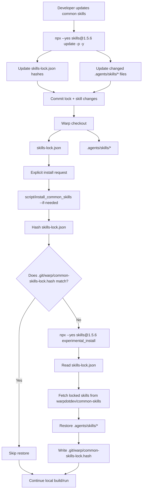

# Common Skills Installation — Tech Spec

## Context
This PR replaces the custom `.agents/common-skills.lock` flow with the standard project lock managed by `npx skills`. The checked-in `skills-lock.json` records each common skill from `warpdotdev/common-skills`, including its source, skill path, and content hash (`skills-lock.json:1`). The repository also checks in the restored `.agents/skills/*` copies so repo-local agent workflows can discover skills directly from the checkout.

The main install entrypoint is `script/install_common_skills`. It points at `skills-lock.json` (`script/install_common_skills:6`) and stores a local, untracked stamp under `.git/warp/common-skills-lock.hash` (`script/install_common_skills:7`). The script hashes the lock (`script/install_common_skills:39`) and skips work when that hash matches the stamp (`script/install_common_skills:119`). When the stamp is missing or stale, it restores from the lock by running `npx --yes "skills@${SKILLS_CLI_VERSION}" experimental_install` (`script/install_common_skills:72`) and writes the new stamp (`script/install_common_skills:127`).

`script/run` can refresh common skills before launching a local build only when the user explicitly passes `--install-common-skills`, which forces a restore. Bootstrap remains opt-in through `./script/bootstrap --install-common-skills` and delegates to the same installer (`script/bootstrap:21`, `script/bootstrap:77`). `WARP.md` documents the standard update command and the files reviewers should expect to change (`WARP.md:41`).

## Diagrams
### Local agent installation and update flow

## Proposed changes
The implementation should keep `skills-lock.json` as the single source of truth for common skills installed from `warpdotdev/common-skills`. The repo should not maintain a second custom lock format or a separate GitHub workflow for scheduled common-skill updates.

`script/install_common_skills` owns restoration from the lock. It should remain small and deterministic: compute a hash for `skills-lock.json`, compare it with a checkout-local stamp, run `npx --yes skills@1.5.6 experimental_install` only when needed, and update the stamp after a successful restore. The stamp belongs under `.git` so running the script does not create or modify tracked files unless the lock itself has been updated intentionally.

`script/run --install-common-skills` should call the installer before building so explicit local developer runs pick up lock changes. This keeps dependency updates reviewable without making normal build/run paths fetch external skill packages by default.

`script/bootstrap --install-common-skills` should continue to be an opt-in bootstrap path and delegate to the same installer. This keeps platform setup and normal run setup consistent.

Updates to common skills should be explicit developer actions: run `npx --yes skills@1.5.6 update -p -y`, review the generated `skills-lock.json` and `.agents/skills/*` changes, and commit them together. This preserves dependency-review semantics without adding repository-specific scheduled automation.

## Testing and validation
Validate the shell changes with `bash -n script/install_common_skills script/run script/bootstrap`.

Validate the Windows bootstrap script parses with PowerShell: `pwsh -NoProfile -Command '$null = [scriptblock]::Create((Get-Content -Raw "script/windows/bootstrap.ps1"))'`.

Validate the restore path by running `./script/install_common_skills --if-needed --quiet` from a checkout without a matching local stamp. It should run the pinned `skills@1.5.6` restore command, restore the locked `.agents/skills/*` contents, and write `.git/warp/common-skills-lock.hash`.

Validate the skip path by running `./script/install_common_skills --if-needed --quiet` again. It should exit successfully without output and without changing the worktree.

Validate update behavior by running `npx --yes skills@1.5.6 update -p -y` in a test checkout or intentional update branch. If upstream common skills changed, the diff should be limited to `skills-lock.json` and the affected `.agents/skills/*` files.
