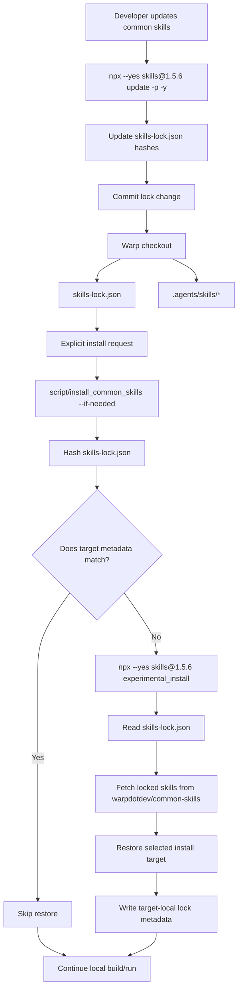

# Common Skills Installation — Tech Spec

## Context
This PR replaces the custom `.agents/common-skills.lock` flow with the standard project lock managed by `npx skills`. The checked-in `skills-lock.json` records each common skill from `warpdotdev/common-skills`, including its source, skill path, and content hash (`skills-lock.json:1`). The repository also checks in the restored `.agents/skills/*` copies so repo-local agent workflows can discover skills directly from the checkout.

The main install entrypoint is `warpdotdev/common-skills/scripts/install_common_skills`. It targets a Warp checkout through `--repo-root <warp-checkout>` or `WARP_COMMON_SKILLS_TARGET_REPO_ROOT`, points at that checkout's `skills-lock.json`, and installs into an explicit target selected by `--project`, `--global`, `WARP_COMMON_SKILLS_INSTALL_TARGET`, or an interactive prompt. If the lock is missing during a normal install, the script creates it by installing the standard common skill set from `warpdotdev/common-skills` with the pinned `skills` CLI. When `WARP_COMMON_SKILLS_REF=<git-ref>` is set, missing-lock creation uses `warpdotdev/common-skills#<git-ref>`. If the lock exists during an interactive normal install, the script checks whether adding the selected common-skills source in a temporary directory would produce a different lock and, when it would, prompts the developer before changing `skills-lock.json`. If the lock is missing during `--verify-only`, the script fails immediately without prompting or creating files.

`script/run` can refresh common skills before launching a local build only when the user explicitly passes `--install-common-skills`, which forces a restore. Bootstrap remains opt-in through `./script/bootstrap --install-common-skills` and delegates to the same installer (`script/bootstrap:21`, `script/bootstrap:77`). `WARP.md` documents the standard update command and the files reviewers should expect to change (`WARP.md:41`).

## Diagrams
### Local agent installation and update flow

## Proposed changes
The implementation should keep `skills-lock.json` as the single source of truth for common skills installed from `warpdotdev/common-skills`. The repo should not maintain a second custom lock format or a separate GitHub workflow for scheduled common-skill updates.

`warpdotdev/common-skills/scripts/install_common_skills` owns lock creation and restoration from the lock for a target checkout. It should remain small and deterministic: if `skills-lock.json` is missing during a normal install, create it from the pinned common-skill source; otherwise compute a hash for `skills-lock.json`, compare it with target-local metadata, run `npx --yes skills@1.5.6 experimental_install` only when needed and allowed, and update the metadata after a successful restore. Project-local metadata belongs under the target checkout's `.git` so normal restore runs do not create or modify tracked files unless the lock itself has been updated intentionally. Global metadata belongs with the global install target so multiple client repos can detect whether they are pinned to the same common-skills lock.

`script/run --install-common-skills` should call the installer before building so explicit local developer runs pick up lock changes. This keeps dependency updates reviewable without making normal build/run paths fetch external skill packages by default.

For interactive normal install flows with an existing lock, `install_common_skills` should compute a candidate updated lock in a temporary directory before resolving the install target. The candidate is generated by adding `warpdotdev/common-skills`, or `warpdotdev/common-skills#<git-ref>` when `WARP_COMMON_SKILLS_REF` is set, with the pinned `skills` CLI. If the candidate lock differs from the checkout's `skills-lock.json`, the script should print that common skills have been updated in the selected source and ask whether to update the checkout lock and reinstall. Accepting copies the candidate lock into the checkout, marks the flow as an explicit lock update, and continues to target resolution and install. Declining discards the candidate and continues from the existing lock. Non-interactive and verify-only flows skip this upstream check entirely.

Updates to common skills should be explicit developer actions: run `npx --yes skills@1.5.6 update -p -y`, review the generated `skills-lock.json` and `.agents/skills/*` changes, and commit them together. This preserves dependency-review semantics without adding repository-specific scheduled automation.

## Testing and validation
Validate the shell changes with `bash -n <common-skills>/scripts/install_common_skills <common-skills>/scripts/remove_common_skills script/resolve_common_skills script/run script/bootstrap`.

Validate the Windows bootstrap script parses with PowerShell: `pwsh -NoProfile -Command '$null = [scriptblock]::Create((Get-Content -Raw "script/windows/bootstrap.ps1"))'`.

Validate the missing-lock path by removing common skills and the lock, then running `<common-skills>/scripts/install_common_skills --repo-root <warp-checkout> --project --if-needed --non-interactive`. It should run the pinned `skills@1.5.6 add warpdotdev/common-skills` command, create `skills-lock.json`, restore the selected project-local target, and write project-local metadata.

Validate the restore path by running `<common-skills>/scripts/install_common_skills --repo-root <warp-checkout> --project --if-needed --quiet` from a checkout without matching project-local metadata but with an existing lock. It should run the pinned `skills@1.5.6` restore command, restore the selected project-local target, and write project-local metadata.

Validate the skip path by running `<common-skills>/scripts/install_common_skills --repo-root <warp-checkout> --project --if-needed --quiet` again. It should exit successfully without output and without changing the worktree.

Validate global sharing by installing common skills globally from two test checkouts with identical `skills-lock.json` contents. The second install should verify and succeed without unnecessarily reinstalling. Then change one checkout's lock and run global setup again; it should fail with the version-mismatch error rather than overwriting the shared global target.

Validate explicit target selection by running the installer in non-interactive mode without `--project`, `--global`, or `WARP_COMMON_SKILLS_INSTALL_TARGET`. It should fail with an actionable target-selection error and must not infer the target from existing installs.

Validate interactive update behavior by using a test checkout whose `skills-lock.json` differs from the current `warpdotdev/common-skills` output and running `<common-skills>/scripts/install_common_skills --repo-root <test-checkout> --if-needed --prompt-for-target`. Before the project/global prompt, the script should report that common skills have been updated and ask whether to update the lock. Accepting should change only `skills-lock.json` before target installation; declining should leave the lock unchanged and continue from the existing lock. Also validate `WARP_COMMON_SKILLS_REF=<branch>` with a branch whose skill content differs from the lock; the update prompt should compare against the branch source and the accepted lock should record that ref.

Validate manual update behavior by running `npx --yes skills@1.5.6 update -p -y` in a test checkout or intentional update branch. If upstream common skills changed, the diff should be limited to `skills-lock.json`.
